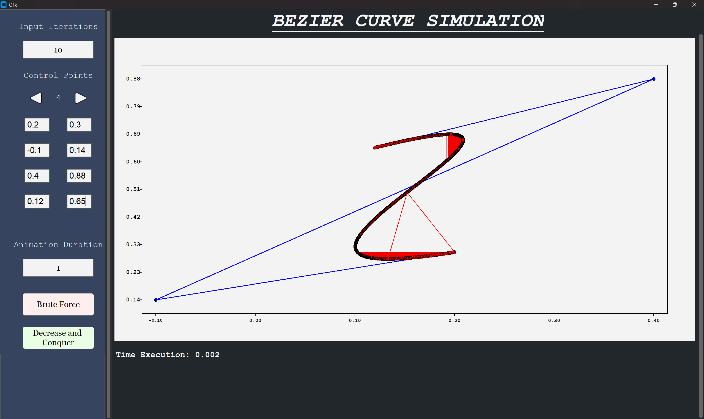

<h1 align="center">Bezier Curves Divide And Conquer Animation</h1>
<p align="center">
  
</p>

## Project Overview
This project is aimed at fulfilling the requirements for Small Task 2 of Algorithm Strategy, which involves implementing the Brute Force and Divide And Conquer algorithms in creating Bezier Curves. The implementation of Bezier Curves also includes the creation of a GUI that can display visual results of the executed algorithms.

## Setup Project

### Requirements
1. Clone this project:
    ```
    git clone https://github.com/Loxenary/Tucil2_13522134_13522157/new/main
    ```
2. Navigate to the src directory:
    ```
    cd src
    ```
3. Install dependencies by installing requirements.txt (Make sure you are inside the src folder):
    ```
    pip install -r requirements.txt
    ```

Once you have completed the above steps, the project setup is complete and the project can be launched. For detailed instructions, see [Running The Project](src/README.md).

## Authors

<b>Special thanks to our contributors:</b>
1. Shabrina Maharani (13522134) <br>
   - GitHub: [LinkToGithub](https://github.com/shabrinamaharani)
2. Muhammad Davis Adhipramana (13522157) <br>
   - GitHub: [LinkToGithub](https://github.com/Davis-Adhipramana)
