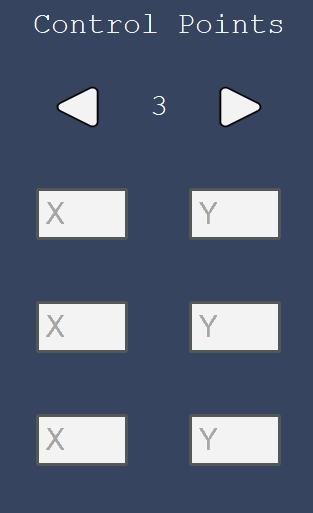

# Running The Program
## Overview
The current project has 2 ways to run the program. The first one use a GUI from tkinter that are saved in the MainProgram folder. The second one are using a cli as its input and utilize a mathplotlib to visualize the result. 

Before going here, make sure to setup the requirements on :<br>
[SETUP](../README.md)
### GUI (Main Program)
This segment will discuss about how to run the Program that use a GUI to input and visualize the result.

#### Feature
- The Result are animated
- The GUI are flexible
- The GUI are pretty

#### Running
1. navigate to MainProgram
    ```
    cd MainProgram
    ```
2. run the main.py (Make sure to do setup in [SETUP](../README.md)
  - it can be done in terminal : 
    ```
    python -m main
    ```
  - it can be directly run from the code editor 
3. Congratulation, the program should be running

#### Input
There are several input in the GUI that the user can use
1. Input Iteration <br><br>
    <br>
   This input only accept a positive number. This input will carry the amount of iteration that will be used by the algorithm later. The User can input up to 500.<br><b>However, we suggest to input a number under 13
   as it took so long to process 13 iterations. </b>
   
2. Input Entry Points <br><br>
   <br>
   The user can click the triangle button to change the amount of Control Points that will be inputted. Then the user can fill the x and y on the data field. The data field can accept a negative, decimal and normal     numbers. However it can't accept any strings.
3. Input Animation Speed <br> <br>
    <br>
   The input default is 40. However the user can put any amount with the max being 500. <br>
   <b>!!! The higher the animation duration, the slower the animation will be !!! </b>
4. Button Funtiono <br><br>
    <br>
   There are 2 function that exist in this project. It is a bruteforce and a divide and conquer.
   - Bruteforce
     The button only accept input control points of 3. 
   - Divide and Conquer
     The button can utiltize any amount of control points <br> <br>
   <p>Once the button are clicked, the output will be shown directly on the whitespace the right side of it</p>

### CLI
This segment will discuss about how to utilize the CLI input

#### Feature
- Fast input using CLI
- Diffrent main for dnc and bruteforce
- Cleaner coordinates because the use of mathplotlib

#### Running
1. Navigate to MathPlotLibProgramVer
  ```
  cd MathPlotLibProgramVer
  ```
2. Run the Main
  Before running, the user can decide what algorithm to use. there are 2 option, it is a bruteforce and dnc.
- Running DNC
  ```
  python -m maindnc
  ```
- Running BruteForce
  ```
  python -m mainbf
  ```
  <p>If the step is done, There should be a window popup from mathplotlib</p>
#### Input
The input utilize normal input on the cli
<p>Example: </p>

